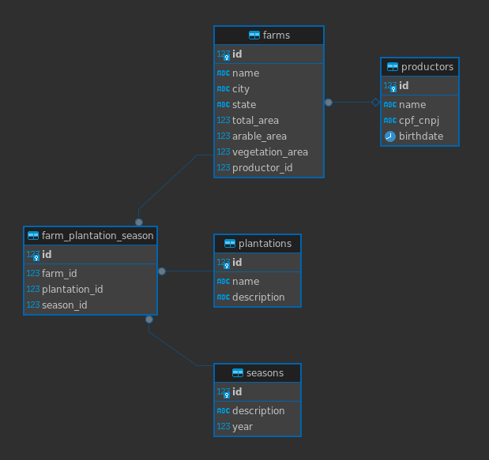

# Brain Agriculture

Este projeto tem o objetivo de ser um serviço backend para uma aplicação de gerenciamento de cadastros de produtores agrícolas.

## Tecnologias Utilizadas

- **FastAPI**: Framework web moderno e rápido (baseado em Python) para construção de APIs.
- **SQLAlchemy**: ORM (Object-Relational Mapping) para interação com o banco de dados.
- **PostgreSQL**: Banco de dados relacional principal da aplicação, utilizado em produção.
- **SQLite**: Banco de dados leve e embutido, utilizado para desenvolvimento e testes.
- **Pydantic**: Biblioteca para validação de dados e gerenciamento de esquemas.
- **Docker**: Plataforma para criação e gerenciamento de contêineres, facilitando a execução do projeto em diferentes ambientes.

## Como rodar o projeto

1. Clone o repositório
2. Criar o banco de dados e rodar a migration: 
`docker-compose run --rm api alembic upgrade head`
2. Execute `docker-compose up --build`
3. Acesse a API em `http://localhost:8000`

## Exemplos de Endpoints

### Health Check
- **Método**: `GET`
- **URL**: `/api/v1/health/`

### Cadastrar Produtor
- **Método**: `POST`
- **URL**: `/api/v1/productor/`
- **Exemplo de Request**:
  ```json
  {
    "name": "João Silva",
    "cpf_cnpj": "123.456.789-09",
    "bithdate": "2000-02-01"
  }
  ```

### Listar Produtores
- **Método**: `GET`
- **URL**: `/api/v1/productor/`

### Detalhes de um Produtor
- **Método**: `GET`
- **URL**: `/api/v1/productor/{produtor_id}`

### Atualizar Produtor
- **Método**: `PUT`
- **URL**: `/api/v1/productor/{produtor_id}`
- **Exemplo de Request**:
  ```json
  {
    "name": "João Silva",
    "cpf_cnpj": "123.456.789-09",
    "birthdate": "1999-02-10"
  }
  ```

### Deletar Produtor
- **Método**: `DELETE`
- **URL**: `/api/v1/productor/{produtor_id}`

### Cadastrar Fazenda
- **Método**: `POST`
- **URL**: `/api/v1/farm/`
- **Exemplo de Request**:
  ```json
  {
    "name": "Fazenda Feliz",
    "produtor_id": 1,
    "city": "São Paulo",
    "state": "SP",
    "total_area": 100.5,
    "arable_area": 80.0,
    "vegetation_area": 20.5
  }
  ```

### Listar Fazendas
- **Método**: `GET`
- **URL**: `/api/v1/farm/`

### Detalhes de uma Fazenda
- **Método**: `GET`
- **URL**: `/api/v1/farm/{farm_id}`

### Atualizar Fazenda
- **Método**: `PUT`
- **URL**: `/api/v1/farm/{farm_id}`
- **Exemplo de Request**:
  ```json
  {
    "name": "Fazenda Feliz",
    "produtor_id": 1,
    "city": "São Paulo",
    "state": "SP",
    "total_area": 100.5,
    "arable_area": 80.0,
    "vegetation_area": 20.5
  }
  ```

### Deletar Fazenda
- **Método**: `DELETE`
- **URL**: `/api/v1/farm/{farm_id}`

## Documentação da API

A documentação interativa da API pode ser acessada através dos seguintes links:

- **Swagger UI**: `http://localhost:8000/docs`
- **ReDoc**: `http://localhost:8000/redoc`
- **Especificação OpenAPI**: [openapi.json](./openapi.json)

## Entidades e relacionamentos

O sistema é composto pelas seguintes entidades principais:

### 1. **Produtor (`Productor`)**
   - **Descrição**: Representa um produtor agrícola.
   - **Atributos**:
     - `id`: Identificador único do produtor.
     - `name`: Nome do produtor.
     - `cpf_cnpj`: CPF ou CNPJ do produtor (único).
     - `birthdate`: Data de nascimento do produtor.
   - **Relacionamentos**:
     - Um produtor pode ter 0 ou várias fazendas (`farms`).

### 2. **Fazenda (`Farm`)**
   - **Descrição**: Representa uma fazenda agrícola.
   - **Atributos**:
     - `id`: Identificador único da fazenda.
     - `name`: Nome da fazenda.
     - `city`: Cidade onde a fazenda está localizada.
     - `state`: Estado onde a fazenda está localizada.
     - `total_area`: Área total da fazenda.
     - `arable_area`: Área cultivável da fazenda.
     - `vegetation_area`: Área de vegetação da fazenda.
   - **Relacionamentos**:
     - Uma fazenda pertence a um produtor (`productor`).
     - Uma fazenda pode ter 0 ou várias plantações associadas a safras (`farm_plantations`).

### 3. **Plantação (`Plantation`)**
   - **Descrição**: Representa uma cultura ou plantação.
   - **Atributos**:
     - `id`: Identificador único da plantação.
     - `name`: Nome da plantação.
     - `description`: Descrição da plantação (opcional).
   - **Relacionamentos**:
     - Uma plantação pode estar associada a 0 ou várias fazendas e safras (`farm_plantations`).

### 4. **Safra (`Season`)**
   - **Descrição**: Representa uma safra agrícola.
   - **Atributos**:
     - `id`: Identificador único da safra.
     - `description`: Descrição da safra.
     - `year`: Ano da safra.
   - **Relacionamentos**:
     - Uma safra pode estar associada a várias fazendas e plantações (`farm_plantations`).

### 5. **Associação Fazenda-Plantation-Safra (`FarmPlantationSeason`)**
   - **Descrição**: Representa a associação entre uma fazenda, uma plantação e uma safra.
   - **Atributos**:
     - `id`: Identificador único da associação.
     - `farm_id`: Identificador da fazenda.
     - `plantation_id`: Identificador da plantação.
     - `season_id`: Identificador da safra.
   - **Relacionamentos**:
     - Está associada a uma fazenda (`farm`), uma plantação (`plantation`) e uma safra (`season`).

### Diagrama de Relacionamentos

```plaintext
Produtor (1) -- (N) Fazenda (1) -- (N) FarmPlantationSeason (N) -- (1) Plantation
                                                              (N) -- (1) Season
```
[]

## Testes unitários

Os testes unitários cobrem as principais rotas da API. 
- testes unitários em `tests/unit/`
- testes de integração em `tests/integration/`

### Rodar os testes 

Como o setup está preparado com docker, sugiro executar via docker mesmo:
`docker compose run --rm api pytest tests/`
